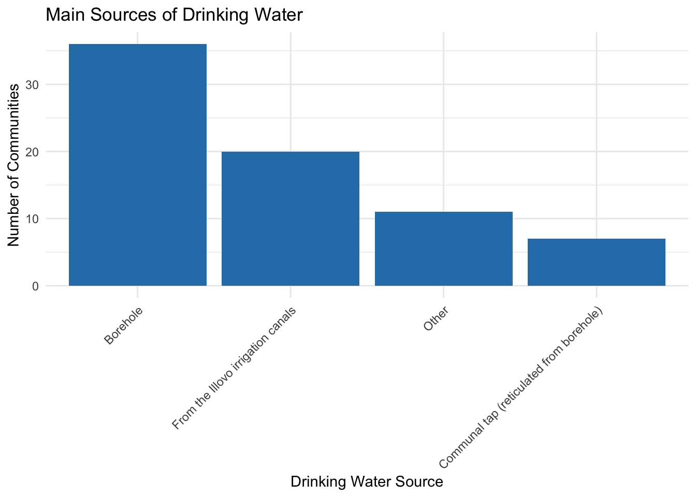
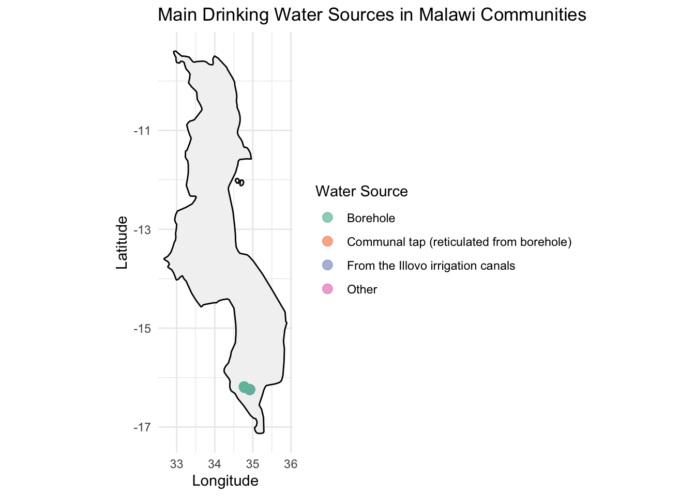

# Nchalo Water Project – Household Survey 2021

[](https://doi.org/10.5281/zenodo.17522182)

[](https://zenodo.org/doi/10.5281/zenodo.17522182)
[](https://github.com/openwashdata/nchalohhwatersurvey/actions/workflows/R-CMD-check.yaml)

This dataset was collected in 2021 using the mWater mobile data
collection platform, as part of the Nchalo Water Project. The survey
captures household-level and community-level information related to
water access, livelihoods, governance, infrastructure, and service
delivery in rural communities around Nchalo, Malawi.

The data reflects conditions at the time of collection and is intended
to support targeted decision-making around water supply projects and
integrated rural development efforts.

1.  **Use cases of the data**  
    Local Government Authorities (District Water Offices, Planning
    Departments) To inform localized infrastructure development and
    service delivery planning.

2.  Non-Governmental Organizations (NGOs) To support rural WASH,
    livelihood improvement, and community empowerment programs.

3.  Donor Agencies and Development Partners For targeting investments
    and evaluating the impact of funded projects.

4.  Researchers and Academics For studying rural development, community
    resilience, water governance, and socio-economic trends.

5.  Community-Based Organizations (CBOs) To advocate for resources, plan
    community-led initiatives, and participate in decision-making.

6.  Monitoring & Evaluation (M&E) Specialists To use as baseline data
    for future assessments or project comparisons.

## Installation

You can install the development version of nchalohhwatersurvey from
[GitHub](https://github.com/) with:

``` r

# install.packages("devtools")
devtools::install_github("openwashdata/nchalohhwatersurvey")
```

``` r

## Run the following code in console if you don't have the packages
## install.packages(c("dplyr", "knitr", "readr", "stringr", "gt", "kableExtra"))
library(dplyr)
library(knitr)
library(readr)
library(stringr)
library(gt)
library(kableExtra)
```

Alternatively, you can download the individual datasets as a CSV or XLSX
file from the table below.

1.  Click Download CSV. A window opens that displays the CSV in your
    browser.
2.  Right-click anywhere inside the window and select “Save Page As…”.
3.  Save the file in a folder of your choice.

| dataset | CSV | XLSX |
|:---|:---|:---|
| nchalohhwatersurvey | [Download CSV](https://github.com/openwashdata/nchalohhwatersurvey/raw/main/inst/extdata/nchalohhwatersurvey.csv) | [Download XLSX](https://github.com/openwashdata/nchalohhwatersurvey/raw/main/inst/extdata/nchalohhwatersurvey.xlsx) |

## Data

The package provides access to community-level household survey
conducted as part of the Nchalo Water Project. Its purpose is to assess
livelihoods, water usage, community governance, infrastructure access,
and opportunities for value addition in the context of a rural water
supply or WASH-related development intervention.

``` r

library(nchalohhwatersurvey)
```

### nchalohhwatersurvey

The dataset `nchalohhwatersurvey` contains 74 observations and 39
variables

``` r

nchalohhwatersurvey |> 
  head(3) |> 
  gt::gt() |>
  gt::as_raw_html()
```

| submitted_on | community_name | latitude | longitude | community_population | main_livelihood_source | main_livelihood_source_comments | income_in_2020_mwk | income_comments | income_spending_priority | main_drinking_water_source | main_drinking_water_source_other | uses_borehole_for_other_purposes | other_borehole_use_comments | reasons_not_pursuing_multiple_uses | reasons_not_pursuing_multiple_uses_other | value_addition_opportunity | value_addition_opportunity_details | value_addition_opportunity_other | land_allocation_responsible_person | leadership_allocation_decider | leadership_allocation_other | gender_guidelines_for_leadership | gender_guidelines_comments | pay_for_water | water_payment_amount | water_payment_frequency | water_payment_frequency_other | reason_for_not_paying | reason_for_not_paying_other | nearest_school_type | govt_school_accessibility | nearest_health_facility_type | health_facility_accessibility | health_facility_accessibility_other | community_solved_social_problem | community_solved_social_problem_comments | flow_rate_test_possible_today | has_temp_ec_tds_meter |
|---:|:---|---:|---:|---:|:---|:---|:---|:---|:---|:---|:---|:---|:---|:---|:---|:---|:---|:---|:---|:---|:---|:---|:---|:---|---:|:---|:---|:---|:---|:---|:---|:---|:---|:---|:---|:---|:---|:---|
| 4/8/2021 | Fote 1 | -16.18446 | 34.77077 | 206 | Ganyu | Piece works at Illovo | between 0 - 100,000 per year | It depends on a particular piece work because sometimes we get k2000 or k1000 | Bought maize/food | Borehole | NA | Nothing | NA | Other | The water is salty so plants wilt | Yes | small scale irrigation, Other | Maize and vegetables | Community leaders/Chiefs | The community decides | NA | Yes | 50-50 campaign | Yes | 200 | Other | When BH breaks down | NA | NA | Government primary School | Yes | Private health clinics | No | NA | Yes | CBO was largely built by us. | No | No |
| 4/7/2021 | Lobert | -16.24128 | 34.92167 | 800 | Farming | NA | More than 600,001 per year | NA | Pucrhase land | From the Illovo irrigation canals | NA | NA | NA | NA | NA | Yes | small scale irrigation | NA | Community leaders/Chiefs | The ADC decides | NA | Yes | NA | No | NA | NA | NA | Other | Illovo canal waters is free | Government primary School | Yes | Private health clinics | No | NA | Yes | NA | No | No |
| 4/7/2021 | Lobert | -16.24128 | 34.92167 | 800 | Farming | NA | between 0 - 100,000 per year | NA | Bought maize/food | From the Illovo irrigation canals | NA | NA | NA | NA | NA | Yes | small scale irrigation | NA | Community leaders/Chiefs | The chief decides | NA | NA | NA | Yes | 300 | Monthly | NA | NA | NA | Government primary School | Yes | Private health clinics | No | NA | No | NA | No | No |

For an overview of the variable names, see the following table.

| variable_name | variable_type | description |
|:---|:---|:---|
| submitted_on | character | Date and time the survey was submitted |
| community_name | character | Name of the community surveyed |
| latitude | numeric | Latitude coordinate of the survey location |
| longitude | numeric | Longitude coordinate of the survey location |
| community_population | numeric | Estimated total number of people in the community |
| main_livelihood_source | character | Primary source of livelihood for the household |
| main_livelihood_source_comments | character | Additional comments on the households main livelihood |
| income_in_2020_mwk | character | Estimated household income in 2020 from the main livelihood source (in MWK) |
| income_comments | character | Additional comments about the reported income |
| income_spending_priority | character | Main priorities for spending the household income |
| main_drinking_water_source | character | Primary source of drinking water for the community |
| main_drinking_water_source_other | character | Specification if Other water source was selected |
| uses_borehole_for_other_purposes | character | Whether the borehole is used for purposes other than drinking |
| other_borehole_use_comments | character | Comments on other uses of borehole water |
| reasons_not_pursuing_multiple_uses | character | Reasons for not using borehole water for multiple purposes |
| reasons_not_pursuing_multiple_uses_other | character | Specification if an Other reason was selected |
| value_addition_opportunity | character | Whether value addition opportunities exist for a new water project |
| value_addition_opportunity_details | character | Details about the identified value addition opportunities |
| value_addition_opportunity_other | character | Specification if an Other opportunity was mentioned |
| land_allocation_responsible_person | character | Person or group responsible for land allocation for new projects |
| leadership_allocation_decider | character | Entity that decides leadership roles in community projects |
| leadership_allocation_other | character | Specification if an Other decision maker was indicated |
| gender_guidelines_for_leadership | character | Existence of gender guidelines in community leadership |
| gender_guidelines_comments | character | Comments on the gender guidelines |
| pay_for_water | character | Whether the community pays for water usage |
| water_payment_amount | numeric | Amount paid for water usage (in MWK) |
| water_payment_frequency | character | Frequency of water payment |
| water_payment_frequency_other | character | Specification if an Other frequency was selected |
| reason_for_not_paying | character | Main reason for not paying for water |
| reason_for_not_paying_other | character | Specification if an Other reason was given |
| nearest_school_type | character | Type of school closest to the community |
| govt_school_accessibility | character | Whether government schools are accessible to all |
| nearest_health_facility_type | character | Type of health facility closest to the community |
| health_facility_accessibility | character | Whether the health facility is affordable and accessible to all |
| health_facility_accessibility_other | character | Specification if an Other accessibility concern was mentioned |
| community_solved_social_problem | character | Whether the community has independently addressed social problems |
| community_solved_social_problem_comments | character | Comments on how social problems were addressed by the community |
| flow_rate_test_possible_today | character | Whether it was possible to conduct a flow rate test during the visit |
| has_temp_ec_tds_meter | character | Whether the team had a temperature and EC or TDS meter available |

## Data Visualization Examples

``` r

library(nchalohhwatersurvey)
# required Libraries
library(tidyverse)
library(maps)
library(ggplot2)
library(dplyr)

# Vizualisation 1: Main sources of drinking water
# Count the frequency of each main drinking water source in the dataset
water_source_counts <- nchalohhwatersurvey %>%
  # Remove rows where main_drinking_water_source is missing
  filter(!is.na(main_drinking_water_source)) %>%
  # Count occurrences of each unique main drinking water source
  count(main_drinking_water_source) %>%
  # Arrange counts in descending order for better visualization
  arrange(desc(n))

# Create a bar chart of the water source counts
ggplot(water_source_counts, aes(x = reorder(main_drinking_water_source, -n), y = n)) +
  # Use geom_bar with identity stat to plot counts
  geom_bar(stat = "identity", fill = "#2c7fb8") +
  # Add chart title and axis labels
  labs(
    title = "Main Sources of Drinking Water",
    x = "Drinking Water Source",
    y = "Number of Communities"
  ) +
  # Use a minimal theme for a clean look
  theme_minimal() +
  # Rotate x-axis labels 45 degrees for readability
  theme(axis.text.x = element_text(angle = 45, hjust = 1))
```



``` r


# Vizualisation 2: Map with points colored by main drinking water source
# Load Malawi map data from maps package
malawi_map <- map_data("world", region = "Malawi")

# Filter your data for plotting (remove missing coords or water sources)
plot_data <- nchalohhwatersurvey %>%
  filter(!is.na(latitude), !is.na(longitude), !is.na(main_drinking_water_source))

# Plot Malawi map with points colored by water source
ggplot() +
  geom_polygon(data = malawi_map, aes(x = long, y = lat, group = group),
               fill = "gray95", color = "black") +
  geom_point(data = plot_data, 
             aes(x = longitude, y = latitude, color = main_drinking_water_source),
             alpha = 0.7, size = 3) +
  scale_color_brewer(palette = "Set2") +
  coord_fixed(1.3) +  # fix aspect ratio
  labs(
    title = "Main Drinking Water Sources in Malawi Communities",
    x = "Longitude",
    y = "Latitude",
    color = "Water Source"
  ) +
  theme_minimal()
```



## License

Data are available as
[CC-BY](https://github.com/openwashdata/nchalohhwatersurvey/blob/main/LICENSE.md).

## Citation

Please cite this package using:

``` r

citation("nchalohhwatersurvey")
#> To cite package 'nchalohhwatersurvey' in publications use:
#> 
#>   Mhango E (2026). "nchalohhwatersurvey: Nchalo Water Project Household
#>   Survey 2021." doi:10.5281/zenodo.17522182
#>   <https://doi.org/10.5281/zenodo.17522182>.
#>   <https://github.com/openwashdata/nchalohhwatersurvey>.
#> 
#> A BibTeX entry for LaTeX users is
#> 
#>   @Misc{mhango:2026,
#>     title = {nchalohhwatersurvey: Nchalo Water Project Household Survey 2021},
#>     author = {Emmanuel Mhango},
#>     year = {2026},
#>     doi = {10.5281/zenodo.17522182},
#>     url = {https://github.com/openwashdata/nchalohhwatersurvey},
#>     abstract = {Household and community survey data from rural communities around Nchalo, Malawi. Includes water access, livelihoods, governance, and infrastructure information collected via mWater platform to support water supply planning and rural development.},
#>     keywords = {open data,washdata,household survey,water supply,boreholes,livelihoods,Nchalo,Malawi,hygiene,sanitation,wash},
#>     version = {0.0.0.9000},
#>   }
```
